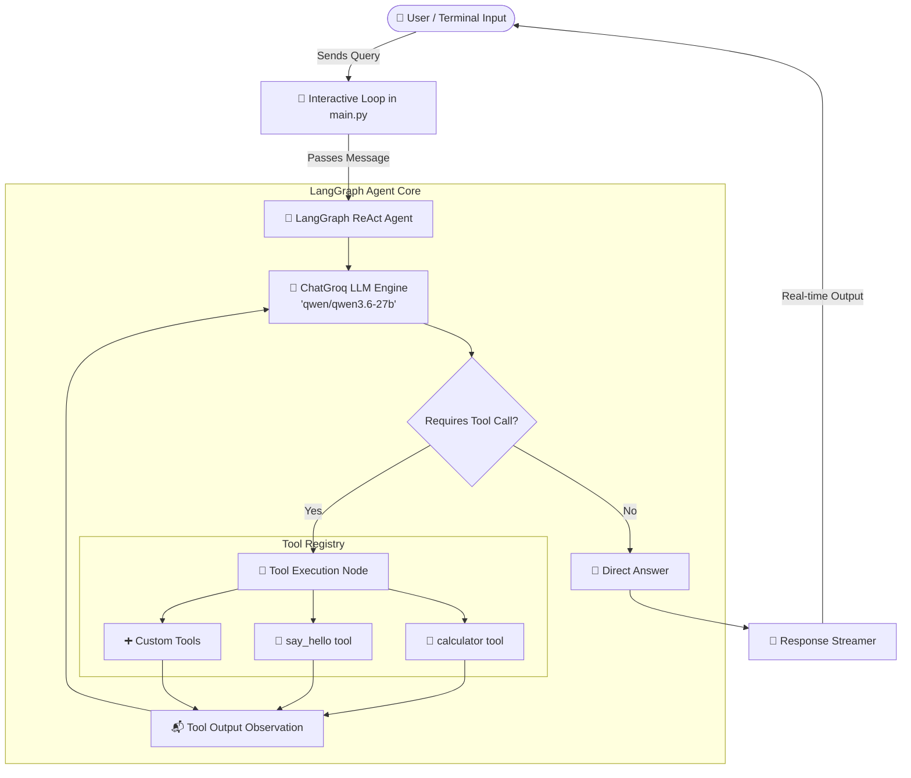
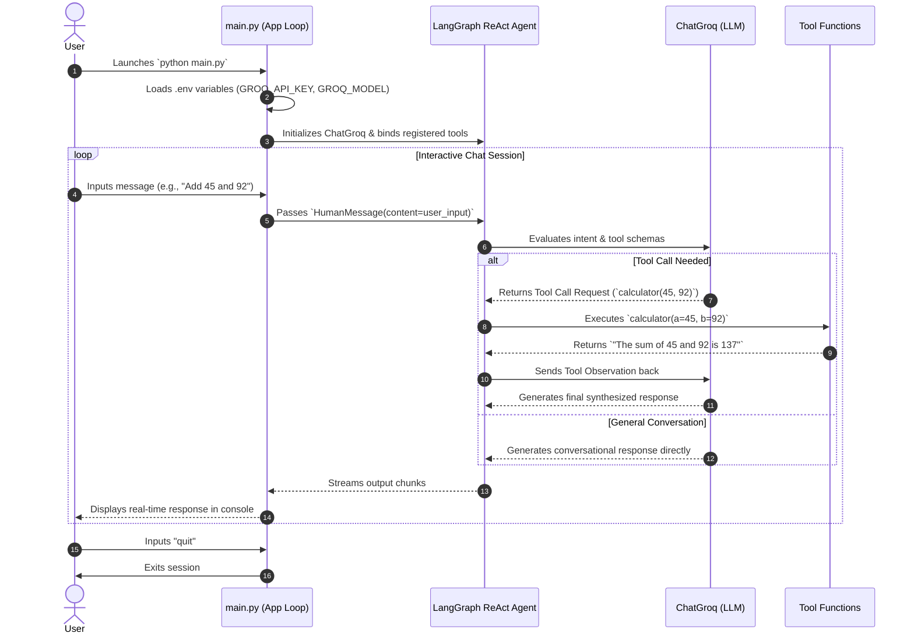

# 🤖 GenAI Agentic Chatbot (LangGraph + Groq)

A modular, intelligent conversational AI assistant built using **LangGraph**, **LangChain**, and **Groq Cloud API**. This project implements a **ReAct (Reasoning and Acting)** agent architecture capable of autonomous reasoning, dynamic tool selection, real-time response streaming, and interactive task execution.

---

## 📌 Table of Contents
- [Overview](#-overview)
- [Key Features](#-key-features)
- [System Architecture](#-system-architecture)
- [Workflow & Execution Flow](#-workflow--execution-flow)
- [Tech Stack](#-tech-stack)
- [Project Structure](#-project-structure)
- [Getting Started & Installation](#-getting-started--installation)
  - [Prerequisites](#prerequisites)
  - [1. Clone / Navigate to Project](#1-clone--navigate-to-project)
  - [2. Create and Activate Virtual Environment](#2-create-and-activate-virtual-environment)
  - [3. Install Dependencies](#3-install-dependencies)
  - [4. Configure Environment Variables](#4-configure-environment-variables)
  - [5. Run the Application](#5-run-the-application)
- [Available Tools & Capabilities](#-available-tools--capabilities)
- [Extending the Agent (Adding New Tools)](#-extending-the-agent-adding-new-tools)
- [Troubleshooting & FAQs](#-troubleshooting--faqs)
- [License](#-license)

---

## 🌟 Overview

The **GenAI Agentic Chatbot** demonstrates the implementation of an agentic workflow powered by fast inference using Groq LLMs (e.g., `qwen/qwen3.6-27b` or `llama-3.3-70b-versatile`) coupled with LangGraph's prebuilt ReAct agent framework.

Instead of operating solely as a static text predictor, the agent can:
1. **Analyze** incoming user queries.
2. **Reason** whether an external function/tool is required.
3. **Execute** appropriate tools (e.g., arithmetic calculations, greeting helpers).
4. **Synthesize** tool results into a coherent final response streamed live to the console.

---

## ✨ Key Features

- **⚡ Blazing-Fast Inference**: Integrates with [Groq API](https://console.groq.com/) for near-instantaneous token generation and low-latency LLM responses.
- **🧠 ReAct Framework**: Built with `langgraph.prebuilt.create_react_agent`, establishing a robust reasoning and acting cycle.
- **🛠️ Extensible Tool Registry**: Easy-to-extend Python `@tool` definitions allowing the LLM to call custom APIs, databases, or local functions.
- **🌊 Streaming Responses**: Real-time token streaming to the terminal for an interactive user experience.
- **🔒 Secure Configuration**: Uses `.env` files and `python-dotenv` for API key and model selection management.

---

## 🏗️ System Architecture

The application adopts a modular ReAct architecture where LangGraph manages state transitions between the user, the LLM reasoning engine, and tool execution nodes.



---

## 🔄 Workflow & Execution Flow



---

## 💻 Tech Stack

| Technology | Purpose |
| :--- | :--- |
| **[Python 3.10+](https://www.python.org/)** | Core programming language |
| **[LangGraph](https://github.com/langchain-ai/langgraph)** | Agent graph construction and ReAct orchestration |
| **[LangChain Core](https://github.com/langchain-ai/langchain)** | Standardized message interfaces and `@tool` decorators |
| **[LangChain Groq](https://github.com/langchain-ai/langchain-groq)** | High-speed LLM integration via Groq Cloud API |
| **[Python Dotenv](https://github.com/theskumar/python-dotenv)** | Environment variable management from `.env` |

---

## 📁 Project Structure

```text
GenAI_KLEBCA/
│
├── .env                  # Environment configuration (API keys, model name) [Ignored in VCS]
├── .env.example          # Sample environment configuration template
├── .venv/                # Python virtual environment directory
├── main.py               # Main application entry point, agent setup & CLI loop
├── requirements.txt      # Project dependencies list
└── README.md             # Project documentation and setup guide
```

---

## 🚀 Getting Started & Installation

Follow these steps to set up and run the chatbot locally on your machine.

### Prerequisites
- **Python 3.10** or higher installed on your system.
- A **Groq Cloud API Key** (Free tier available at [console.groq.com](https://console.groq.com/keys)).

---

### 1. Clone / Navigate to Project

Open your terminal and navigate to the project directory:
```bash
cd c:\Users\HP\Desktop\GenAI_KLEBCA
```

---

### 2. Create and Activate Virtual Environment

It is recommended to use an isolated Python virtual environment:

#### On Windows (PowerShell):
```powershell
# Create virtual environment (if not already created)
python -m venv .venv

# Activate virtual environment
.venv\Scripts\Activate.ps1
```

#### On Windows (Command Prompt):
```cmd
.venv\Scripts\activate.bat
```

#### On Linux / macOS:
```bash
python3 -m venv .venv
source .venv/bin/activate
```

---

### 3. Install Dependencies

Install all required packages from `requirements.txt`:
```bash
pip install -r requirements.txt
```

---

### 4. Configure Environment Variables

Create a `.env` file in the root directory (or edit the existing one):

```env
# Groq API Configuration
GROQ_API_KEY=your_groq_api_key_here

# Model Selection (e.g. qwen/qwen3.6-27b, llama-3.3-70b-versatile)
GROQ_MODEL=qwen/qwen3.6-27b
```

> ⚠️ **Security Tip:** Never commit your actual `.env` file containing secrets to version control (e.g., GitHub). Keep `.env` in your `.gitignore`.

---

### 5. Run the Application

Start the interactive chatbot:

```bash
python main.py
```

#### Sample Interaction:
```text
Initializing Groq model: qwen/qwen3.6-27b...
Welcome! I'm your PythonAIChatbot assistant. Type 'quit' to exit.
You can ask me to perform calculations or chat with me.

You: Can you greet Alice?
Tool has been called.

Assistant: Hello Alice, I hope you are well today!

You: What is 128 plus 256?
Tool has been called.

Assistant: The sum of 128 and 256 is 384.

You: quit
```

---

## 🛠️ Available Tools & Capabilities

The agent currently ships with built-in tools defined via `@tool`:

| Tool Name | Parameters | Description |
| :--- | :--- | :--- |
| `calculator` | `a: float`, `b: float` | Computes the arithmetic sum of two numbers. |
| `say_hello` | `name: str` | Generates a friendly greeting tailored to the provided name. |

---

## 🧩 Extending the Agent (Adding New Tools)

You can easily register custom tools for the agent to use. Simply define your function with the `@tool` decorator in `main.py`:

```python
from langchain_core.tools import tool

@tool
def get_weather(city: str) -> str:
    """Fetch current weather report for a given city."""
    # Custom API call or logic here
    return f"The weather in {city} is sunny and 25°C."

# Add the new tool to the tools list in main():
tools = [calculator, say_hello, get_weather]
```

LangGraph automatically extracts the docstring and type hints to create the tool schema for the LLM.

---

## ❓ Troubleshooting & FAQs

### 1. `GROQ_API_KEY is not set in environment`
- Ensure that the `.env` file exists in the project root directory and contains `GROQ_API_KEY=gsk_...`.
- Make sure `load_dotenv()` is called prior to `os.getenv()`.

### 2. ModuleNotFoundError
- Ensure your virtual environment is active (`(.venv)` should appear in your terminal prompt).
- Re-run `pip install -r requirements.txt`.

### 3. Exiting the Chatbot
- Type `quit` in lowercase to cleanly terminate the session.

---

## 📄 License

This project is created for educational and experimental purposes under GenAI / KLE BCA coursework. Feel free to adapt and expand it for your agentic AI workflows.
